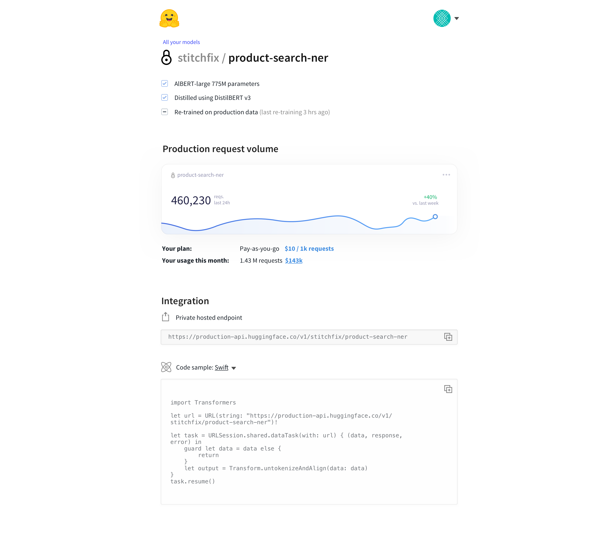

## 🔥 design and implementation of awesome Web interfaces for cutting-edge NLP tools 🔥

### 🤗🤗 Hugging Face Frontend/Full-stack developer code exercise 🤗🤗

#### THE GOAL

The goal is to implement a few of the elements from the mockups in the `/mockups` folder.

Those are all possible UIs that we may want to build in the future. For instance a NLP model page:

__Choose a few amongst the UI elements in those images (there's also a .sketch file for precise measurements/specs) and implement them.__

## Tooling to use.

The tooling we use is kinda specific so **please take a moment to familiarize yourself with it**.
__It is normal if it takes an hour or two and is an important part of the test.__

**Common requirements**

You'll need to install Node and Typescript:
- `npm install typescript -g` (install Typescript globally)
- Install npm dependencies everywhere they're needed. (front/, grunt/, server/).

**`front/`**: 

- the html templates are in `views/` (they are handlebars templates, cf. `server` below). At the moment there is just one layout, and one welcome page.
- The JS is written in Typescript and is inside `js-src/`. The entry point is `controller.ts`. The build system is two-phased: 
    - first compile the TS using `tsc` (you can use the tsc:watch task from vscode),
	- then compile the JS using `rollup`.
 
**`grunt/`**:

- We just use grunt (and `less-css`) to generate our CSS and watch/livereload all the frontend changes: 
- `grunt` to compile only once.
- `grunt watch` to watch and re-compile.

**`server/`**:

This is a super simple `express` app.
- `tsc` or `tsc -w` to compile (and watch).
- `node dist/server.js`

In conjunction with tsc watch you can use `supervisor.sh` to auto-reload when there's a change on the server side.

## Task orchestration

The easiest way to build and watch all these different tasks is [VSCode](https://code.visualstudio.com/). It is generally a nice environment to code and build in.

Use Cmd+Shift+B to launch tasks one by one (or you can use the command line if you prefer).

## How to submit your work

Please upload the initial snapshot of the exercise (i.e. this current folder) and your changes, to a private GitHub or GitLab repo.

__Good luck and have fun!__

